# High-level Design (概要设计规约)

## Prototype Design (原型设计)

前端页面设计

### 主页

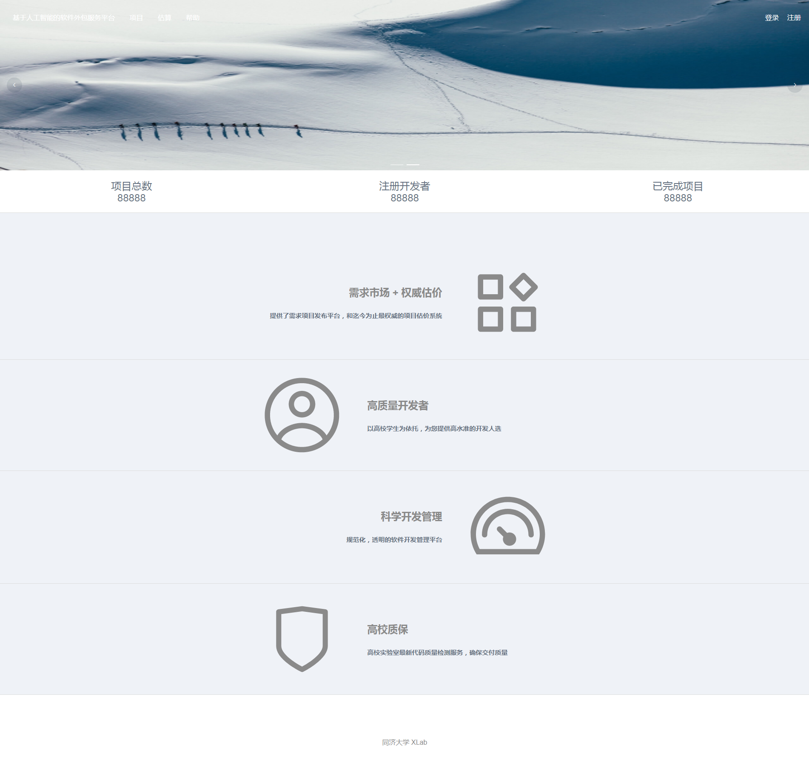

### 登录 

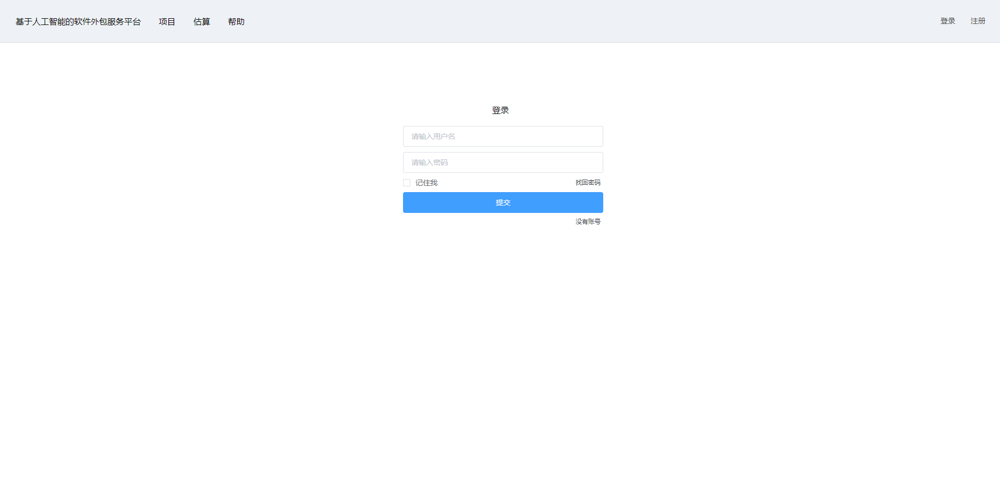

### 注册

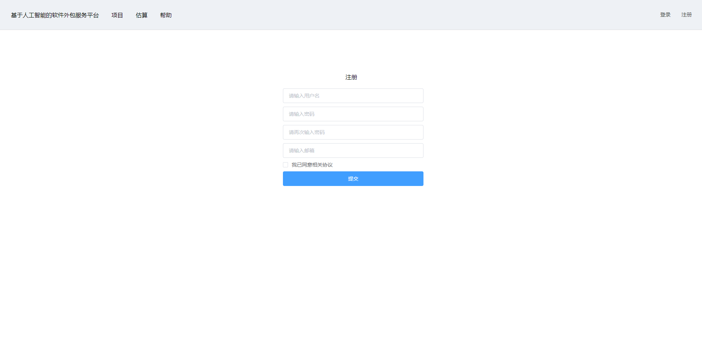

### 个人中心 （限登录后）

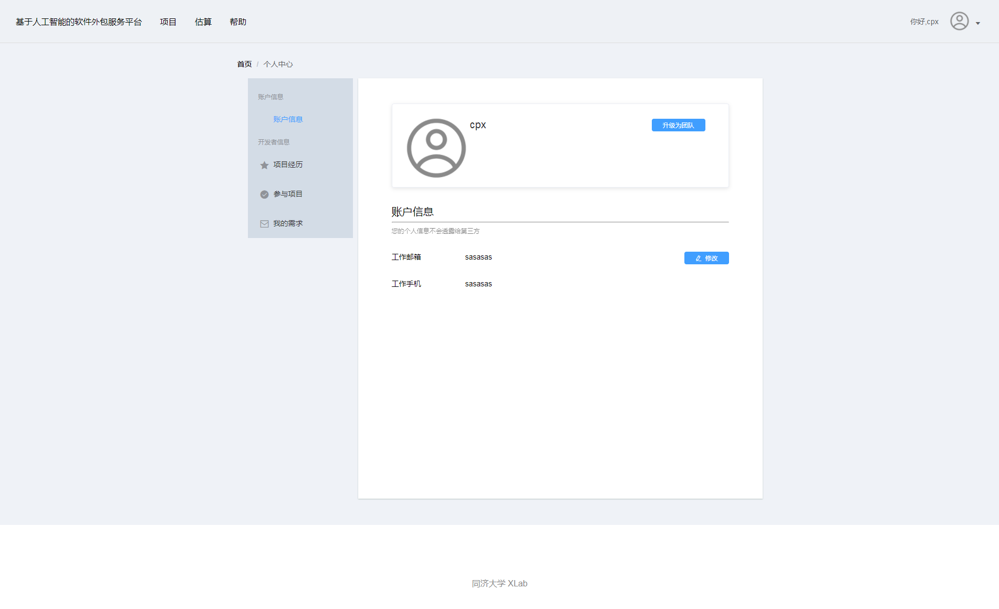

### 个人项目经历 （限登录后）

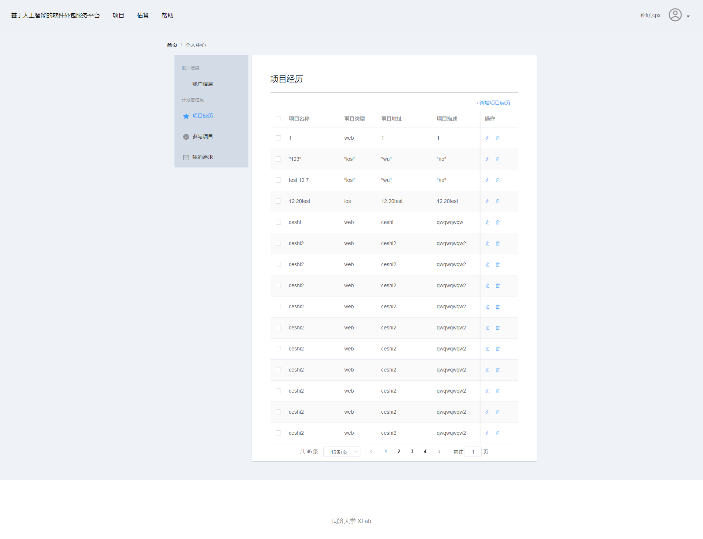

### 个人参与项目 （限登录后）

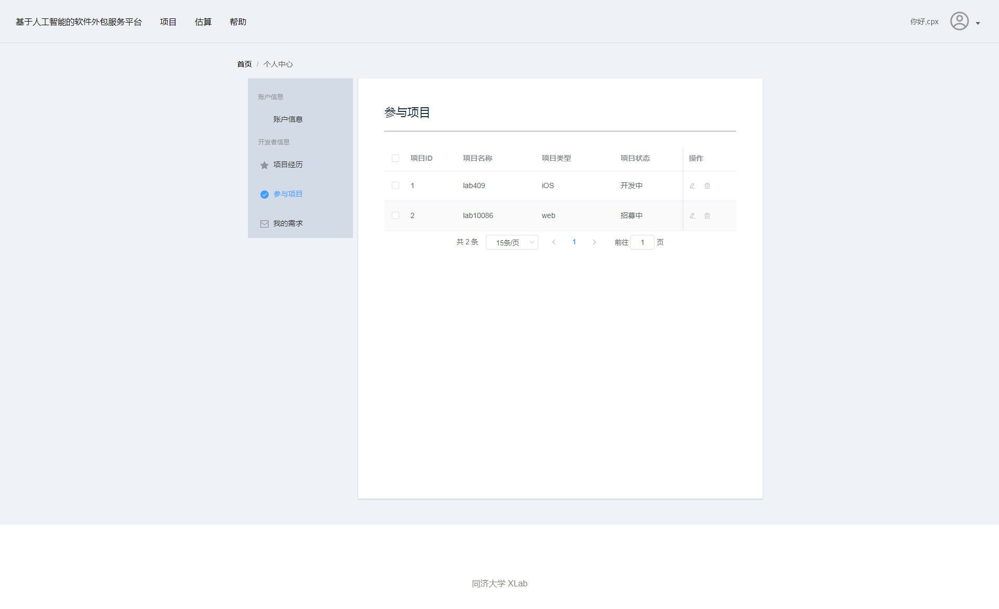

### 个人需求 （限登录后）

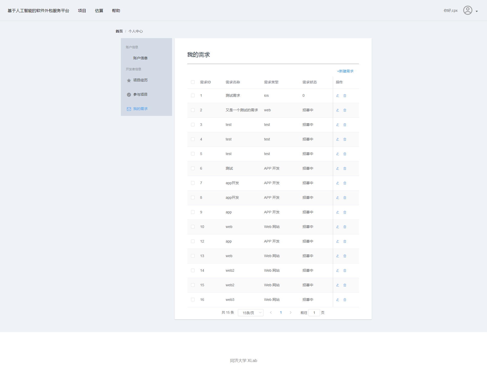

### 修改个人信息 （限登录后）


### 新建/修改项目经历 （限登录后）

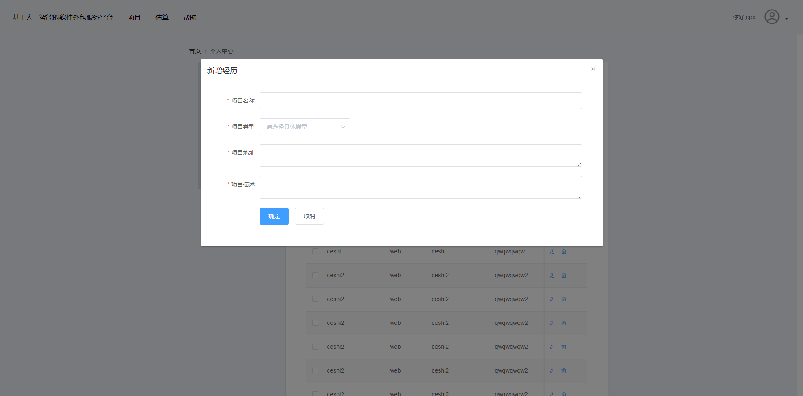

### 新建/修改个人需求 （限登录后）

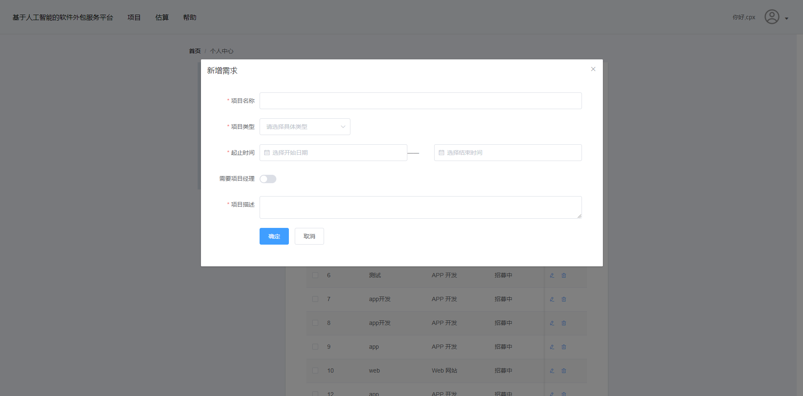

### 全站项目 （登录后）

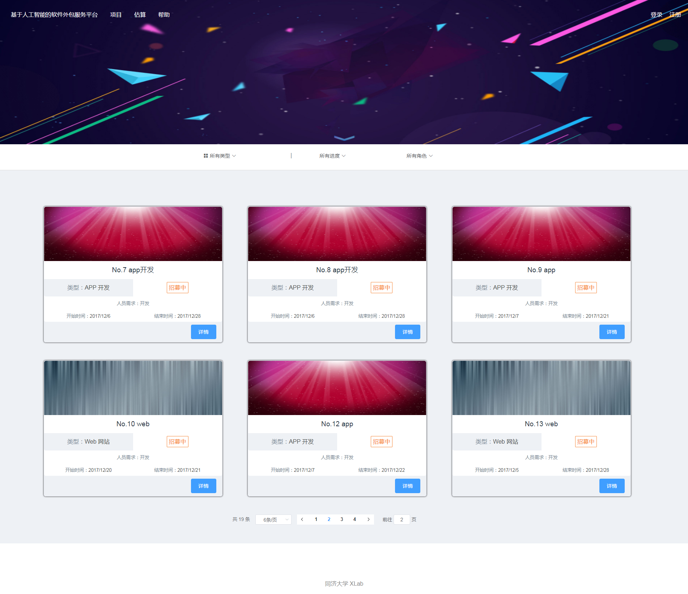

### 项目详情 （登录后）

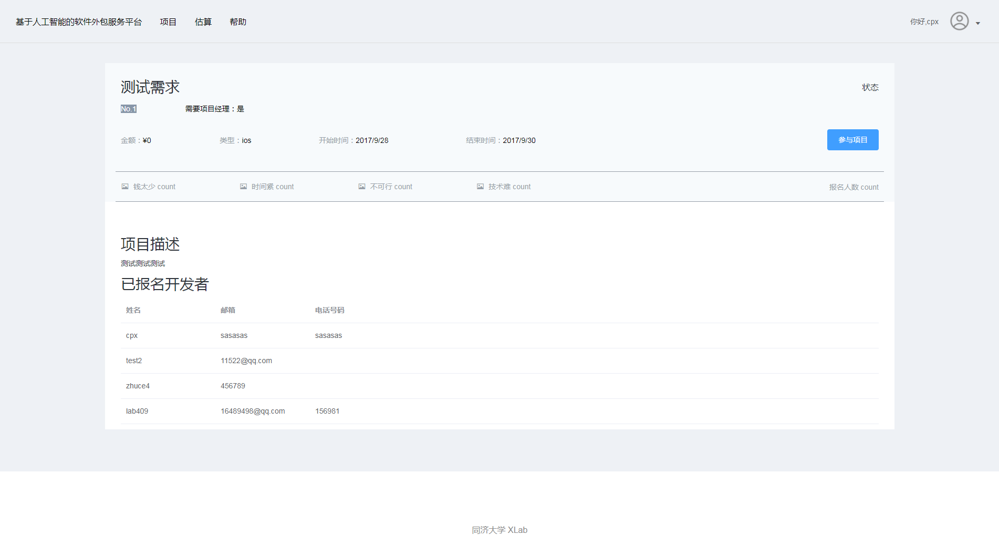

## Business Architecture (业务架构)

The business architecture outline the key components in each layers of the project systems.

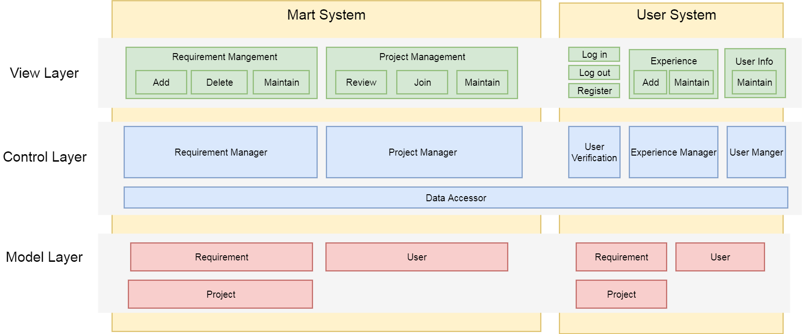

## Technology Architecture (技术架构)

The architecture of the technology stacks (coding language, frameworks, libraries, styles, etc) used in the project.

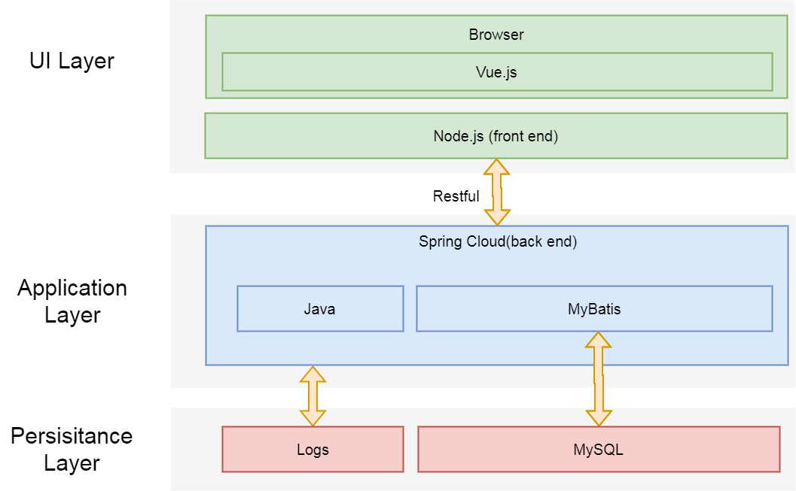

--------------------------------------------------------------------------here-----------------------------------------------------------------------------

## Deployment Topology (部署结构)

Deployment Topology shows how the whole project is deployed in the physical environment, including servers, VMs/containers, networks, key components, etc. A overview picture is required to show the topology. Here is a sample picture of Deployment Topology:


## Data Models (数据建模)

### Entity-Relation Design (实体-关系设计)
 
An Entity-Relation Diagram is required to show the concepts in the project and their relations. And for each entity and realtion, there should be a description after the diagram.

Here gives a sample E-R diagram:

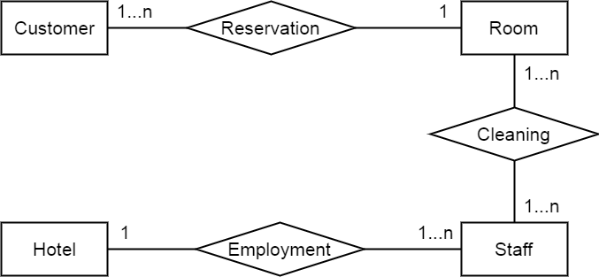

### Database Design (数据库设计)

According to the Entity-Realtion Design, the detailed database design for entities and relations should be listed as tables. Here gives a table template:

**Table: User**

| Column | Type | Description |
|:---:|:---:|:---|
| id | integer | key, identifier |
| name | char[64] | name of the user |

--------------------------------------------------------------------------here-----------------------------------------------------------------------------
## Interface Specifications （接口规约）

The specifications of interfaces used in interactions among subsystems.

---
### */api/session*   

#### Description (接口描述)

A Registered user to Login.

#### request Method (请求方式)
POST
#### request header (请求头)
|  Key| Required | value |
|:-:|:-:|:-|:-:|:-|
|Authorization | No |
|Conent-Type | Yes |application/json|


#### Parameters (请求参数)

| Name |  Required | Type | Default value | Description |
|:-:|:-:|:-|:-:|:-|
| username | true |string | "" |user name |
| password | true |string | ""|user password |

#### response header (返回头)
|  code|type|Description|Content-Type|
|:-:|:-:|:-|:-:|:-|
| 200 |number|response success|application/json|
| 500 |number|server error|application/json|

#### Responses (返回结果)
| Name |  Required | Type | Description|
|:----|:--------:|:--:|
| status | true |string |200: login succes  ; 404: user doesn't exit;|
| result： | true | object| user information|
| + tokenid|true|string| token id|
| + username|true|string|account name|
| + realname|true|string|real name|
| + email|true|string|user's email |
| + mobile|true|string|user's phone number|

#### Request Sample (示例请求)

```
http://10.60.38.173:30001/api/session
```
```
{
 "username":"cpx",
 "password":"123456"
 }
```
#### Response Sample (示例结果)

```
{
    "status": "200",
    "result": {
        "tokenid": "7d98d138afa6efd54a88e601506eccb7",
        "username": "cpx",
        "realname": "成派宣",
        "mobile": "sasasas",
        "email": "sasasas"
    }
}
```
---
### */api/register*   

#### Description (接口描述)

Create a new account.

#### request Method (请求方式)
POST
#### request header (请求头)
|  Key| Required | Value |
|:-:|:-:|:-|
|Authorization | No |
|Conent-Type | Yes |application/json|

#### Parameters (参数)

| Name |  Required | Type | Default value | Description |
|:-|:-:|:-:|:-:|:-|
| username | true |string | "" |account name |
| password | true |string | ""|account password |
| email | true |string | ""|user email |

#### response header (返回头)
|  code|type|Description|Content-Type|
|:-:|:-:|:-|:-:|:-|
| 200 |number|response success|application/json|
| 500 |number|server error|application/json|

#### Responses (返回结果)
| Name |  Required | Type | Description|
|:----|:--------|:--|
| status | true |string |201: register succes; 400:register fail;|
| result： | true | string|description of weather your register success |

#### Request Sample (示例请求)

```
http://10.60.38.173:30001/api/register
```
```
{
    "username": "shilie", 
    "email": "121212323", 
    "password": "123456"
}
```
#### Response Sample (示例结果)

```
{
    "status": "201",
    "result": "注册成功"
}
```
---
### */api/account*   

#### Description (接口描述)

Modify account information.

#### request Method (请求方式)
POST
#### request header (请求头)
|  Key| Required | Value |
|:-:|:-:|:-|:-:|:-|
|Authorization | Yes |cc1e0fbe14779d3958efc295e5b28f8a|
|Conent-Type | Yes |application/x-www-form-urlencoded|

#### Parameters (参数)

| Name |  Required | Type | Default value | Description |
|:-|:-:|:-:|:-:|:-|
| name | true |string | "" |account name |
| email | true |string | ""|user email |
| mobile | true |string | ""|user phone number |

#### response header (返回头)
|  code|type|Description|Content-Type|
|:-:|:-:|:-|:-:|:-|
| 200 |number|response success|application/json|
| 500 |number|server error|application/json|

#### Responses (返回结果)
| Name |  Required | Type | Description|
|:----|:--------:|:--:|
| status | true |string |200: modify succes; 400:modify fail;|
| result： | true | string|description of weather your modify success |

#### Request Sample (示例请求)

```
http://10.60.38.173:30001/api/account
```
```
name:wujie
email:wiiwiwiwiwiwiw
mobile:sasasasasasasas
```
#### Response Sample (示例结果)

```
{
    "status": "200",
    "result": "修改成功"
}
```
---
### */api/user/projectExperience*   

#### Description (接口描述)

Get user's project Experiences.

#### request Method (请求方式)
GET
#### request header (请求头)
|  Key| Required | Value |
|:-:|:-:|:-|:-:|:-|
|Authorization | Yes |cc1e0fbe14779d3958efc295e5b28f8a|
|Conent-Type | No |


#### Parameters (参数)
None

#### response header (返回头)
|  code|type|Description|Content-Type|
|:-:|:-:|:-|:-:|:-|
| 200 |number|response success|application/json|
| 500 |number|server error|application/json|

#### Responses (返回结果)
| Name |  Required | Type | Description|
|:----|:--------:|:--:|
| status | true |string |200: Request succes;400:Request fail ;401:Lack of authority;|
| result： | true | object| |
| + id | true | number| project id |
| + accountId | true | number| account id|
| + certificate | false | file| |
| + projectName | true | string| project's name |
| + projectRegion | true | string| project's type |
| + projectAddress | true | string| project's url address |
| + projectText | true | string | project's dexcription|

#### Request Sample (示例请求)

```
http://10.60.38.173:30001/api/user/projectExperience
```
#### Response Sample (示例结果)

```
{
    "status": "200",
    "result": [
        {
            "id": 1,
            "accountId": 14,
            "certificate": null,
            "projectName": "1",
            "projectRegion": "web",
            "projectAddress": "1",
            "projectText": "1"
        },
        {
            "id": 5,
            "accountId": 14,
            "certificate": null,
            "projectName": "\"123\"",
            "projectRegion": "\"ios\"",
            "projectAddress": "\"wu\"",
            "projectText": "\"no\""
        }
    ]
}
```
---
### */api/user/projectExperience*   

#### Description (接口描述)

Add a new project Experience.

#### request Method (请求方式)
POST
#### request header (请求头)
|  Key| Required |  Value|
|:-:|:-:|:-|:-:|:-|
|Authorization | Yes |cc1e0fbe14779d3958efc295e5b28f8a|
|Conent-Type | Yes |application/x-www-form-urlencoded|

#### Parameters (参数)
| Name |  Required | Type | Default value | Description |
|:-|:-:|:-:|:-:|:-|
| project_name | true |string | "" |project's name |
| project_region | true |string | ""|project's type |
| project_address | true |string | ""|project's url address |
| project_text | true |string | ""|project's description |

#### response header (返回头)
|  code|type|Description|Content-Type|
|:-:|:-:|:-|:-:|:-|
| 200 |number|response success|application/json|
| 500 |number|server error|application/json|

#### Responses (返回结果)
| Name |  Required | Type | Description|
|:----|:--------:|:--:|
| status | true |string |201:Add succes;400:Add fail ;401:Lack of authority;|
| result： | true | object| |
| +  id | true | number| project id |
| + accountId | true | number| account id|
| + certificate | false | file| |
| + projectName | true | string| project's name |
| + projectRegion | true | string| project's type |
| + projectAddress | true | string| project's url address |
| + projectText | true | string | project's dexcription|

#### Request Sample (示例请求)

```
http://10.60.38.173:30001/api/user/projectExperience
```
```
project_name:ssss
project_region:微信小程序
project_address:ssssssssssssssss
project_text:sssssssssssssssssssssssss
```
#### Response Sample (示例结果)

```
{
    "status":"201",
    "result":{
        "id":59,
        "accountId":14,
        "certificate":null,
        "projectName":"ssss",
        "projectRegion":"微信小程序",
        "projectAddress":"ssssssssssssssss",
        "projectText":"sssssssssssssssssssssssss"
    }
}
```
---
### */api/user/projectExperience*   

#### Description (接口描述)

Modify a project Experience's information.

#### request Method (请求方式)
PUT
#### request header (请求头)
|  Key| Required | value |
|:-:|:-:|:-|:-:|:-|
|Authorization | Yes |cc1e0fbe14779d3958efc295e5b28f8a|
|Conent-Type | Yes |application/x-www-form-urlencoded|

#### Parameters (参数)
| Name |  Required | Type | Default value | Description |
|:-|:-:|:-:|:-:|:-|
| project_id | true |number |  |project's id |
| project_name | true |string | "" |project's name |
| project_region | true |string | ""|project's type |
| project_address | true |string | ""|project's url address |
| project_text | true |string | ""|project's description |

#### response header (返回头)
|  code|type|Description|Content-Type|
|:-:|:-:|:-|:-:|:-|
| 200 |number|response success|application/json|
| 500 |number|server error|application/json|

#### Responses (返回结果)
| Name |  Required | Type | Description|
|:----|:--------:|:--:|
| status | true |string |201:Modify succes;400:Modify fail ;401:Lack of authority;|
| result： | true | object| |
| + id | true | number| project id |
| + accountId | true | number| account id|
| + certificate | false | file| |
| + projectName | true | string| project's name |
| + projectRegion | true | string| project's type |
| + projectAddress | true | string| project's url address |
| + projectText | true | string | project's dexcription|

#### Request Sample (示例请求)

```
http://10.60.38.173:30001/api/user/projectExperience
```
```
project_id:1
project_name:12212121
project_region:web
project_address:web
project_text:1
```
#### Response Sample (示例结果)

```
{
    "status":"201",
    "result":{
        "id":1,
        "accountId":14,
        "certificate":null,
        "projectName":"12212121",
        "projectRegion":"web",
        "projectAddress":"web",
        "projectText":"1"
    }
}
```
---
### */api/user/projectExperience*   

#### Description (接口描述)

Delete a project Experience.

#### request Method (请求方式)
Delete
#### request header (请求头)
|  Key| Required |  value|
|:-:|:-:|:-|:-:|:-|
|Authorization | Yes |cc1e0fbe14779d3958efc295e5b28f8a|
|Conent-Type | No ||

#### Parameters (参数)
none

#### response header (返回头)
|  code|type|Description|Content-Type|
|:-:|:-:|:-|:-:|:-|
| 200 |number|response success|application/json|
| 500 |number|server error|application/json|

#### Responses (返回结果)
| Name |  Required | Type | Description|
|:----|:--------:|:--:|
| status | true |string |200:Delete succes;400:Delete fail ;401:Lack of authority;|
| result： | true | String|Description of weather your delete sucess |

#### Request Sample (示例请求)

```
http://10.60.38.173:30001/api/user/projectExperience
```
#### Response Sample (示例结果)

```
{
    "status":"200",
    "result":"删除成功"
}
```
---
### */api/project*   

#### Description (接口描述)

Get all projects that I participated.

#### request Method (请求方式)
GET
#### request header (请求头)
|  Key| Required | value |
|:-:|:-:|:-|:-:|:-|
|Authorization | Yes |cc1e0fbe14779d3958efc295e5b28f8a|
|Conent-Type | No ||

#### Parameters (参数)
none

#### response header (返回头)
|  code|type|Description|Content-Type|
|:-:|:-:|:-|:-:|:-|
| 200 |number|response success|application/json|
| 500 |number|server error|application/json|

#### Responses (返回结果)
| Name |  Required | Type | Description|
|:----|:--------:|:--:|
| status | true |string |200:Require succes;400:Require fail ;401:Lack of authority;|
| result： | true | list| |
| + project_id | true | number| project id |
| + project_name | true | string| project's name |
| + project_type | true | string| project's type |
| + project_state | true | number| project's state |

#### Request Sample (示例请求)

```
http://10.60.38.173:30001/api/project
```
#### Response Sample (示例结果)

```
{
    "status":"200",
    "result":[
    {
        "project_id":1,
        "project_name":"aaaaaaaaaa",
        "project_type":"APP开发",
        "project_state":0
    },
    {
        "project_id":2,
        "project_name":"aaaaaaaaaa",
        "project_type":"APP 开发",
        "project_state":0
    }]
}
```
---
### */api/requirement*   

#### Description (接口描述)

Get all projects that I created.

#### request Method (请求方式)
GET
#### request header (请求头)
|  Key| Required |  value|
|:-:|:-:|:-|:-:|:-|
|Authorization | Yes |cc1e0fbe14779d3958efc295e5b28f8a|
|Conent-Type | No ||

#### Parameters (参数)
none

#### response header (返回头)
|  code|type|Description|Content-Type|
|:-:|:-:|:-|:-:|:-|
| 200 |number|response success|application/json|
| 500 |number|server error|application/json|

#### Responses (返回结果)
| Name |  Required | Type | Description|
|:----|:--------:|:--:|
| status | true |string |200:Require succes;400:Require fail ;401:Lack of authority;|
| result： | true | list| |
| + requirement_id | true | number| project id |
| + requirement_name | true | string| project's name |
| + requirement_type | true | string| project's type |
| + requirement_state | true | number| project's state |

#### Request Sample (示例请求)

```
http://10.60.38.173:30001/api/requirement
```
#### Response Sample (示例结果)

```
{
    "status": "200",
    "result": [
        {
            "requirement_id": 2,
            "requirement_name": "又是一个测试的需求",
            "requirement_type": "web",
            "requirement_state": 2
        },
        {
            "requirement_id": 4,
            "requirement_name": "test",
            "requirement_type": "test",
            "requirement_state": 1
        }
    ]
}
```
---
### *api/project/add*   

#### Description (接口描述)

Create a new project.

#### request Method (请求方式)
POST
#### request header (请求头)
|  Key| Required | value |
|:-:|:-:|:-|:-:|:-|
|Authorization | Yes |a154603bf45e2cf5463b05aa83548076|
|Conent-Type | Yes | application/x-www-form-urlencoded|

#### Parameters (参数)
| Name |  Required | Type | Default value | Description |
|:-|:-:|:-:|:-:|:-|
|project_name|true|String|""|project name|
|project_type|true|String|""|project type|
|cost|true|number|0|project cost|
|delivery_cycle|true|number|5|project delivery time|
|warranty_cycle|true|number|10|project latest delivery time|
|address|true|String|""|project url address|
|description|true|String|project description|
|file|false|||

#### response header (返回头)
|  code|type|Description|Content-Type|
|:-:|:-:|:-:|:-|
| 200 |number|response success|application/json|
| 500 |number|server error|application/json|

#### Responses (返回结果)
| Name |  Required | Type | Description|
|:-:|:-:|:-:|:-|
| status | true |string |200: Add success;400:Add fail ;401:Lack of authority;|
|result|true|var|success decription|
#### Request Sample (示例请求)

```
http://10.60.38.173:30001/api/project/add
```
```
project_name:bbbbbbb
project_type:APP 开发
cost:0
delivery_cycle:5
warranty_cycle:10
address:上海
description:bbbbbbbbbbbbbbbbbbbbbbbb
```
#### Response Sample (示例结果)

```
{
    "status":"200",
    "result":25
}
```
---
### */api/requirement*   

#### Description (接口描述)

Create a new requirement.

#### request Method (请求方式)
POST
#### request header (请求头)
|  Key| Required | value |
|:-:|:-:|:-|:-:|:-|
|Authorization | Yes |a154603bf45e2cf5463b05aa83548076|
|Conent-Type | Yes | application/x-www-form-urlencoded|

#### Parameters (参数)
| Name |  Required | Type | Default value | Description |
|:-|:-:|:-:|:-:|:-|
|project_id|true|number||project id|
|requirement_name|true|String|""|requirement name|
|requirement_type|true|String|""|project type|
|start_time|true|date|0|requirement start time|
|end_time|true|date|0|requirement end time|
|need_manager|true|number|0|if you need a manager|
|requirement_detail|true|String|""|requirment description|
|file|false|||

#### response header (返回头)
|  code|type|Description|Content-Type|
|:-:|:-:|:-:|:-|
| 200 |number|response success|application/json|
| 500 |number|server error|application/json|

#### Responses (返回结果)
| Name |  Required | Type | Description|
|:-:|:-:|:-:|:-|
| status | true |string |201: Add success;400:Add fail ;401:Lack of authority;|
|result|true|var|success decription|
#### Request Sample (示例请求)

```
http://10.60.38.173:30001/api/requirement
```
```
project_id:25
requirement_name:bbbbbbb
requirement_type:APP 开发
start_time:2018-01-16
end_time:2018-01-24
need_manager:1
requirement_detail:bbbbbbbbbbbbbbbbbbbbbbbb
(empty)
```
#### Response Sample (示例结果)

```
{
    "status":"201",
    "result":"创建需求成功"
}
```
---
### */api/requirement/{id}*   

#### Description (接口描述)

Get information of a requirement.

#### request Method (请求方式)
GET
#### request header (请求头)
|  Key| Required | value |
|:-:|:-:|:-|:-:|:-|
|Authorization | Yes |a154603bf45e2cf5463b05aa83548076|
|Conent-Type | No ||

#### Parameters (参数)
| Name |  Required | Type | Default value | Description |
|:-:|:-:|:-:|:-:|:-|
|project_id|true|number||project id|

#### response header (返回头)
|  code|type|Description|Content-Type|
|:-:|:-:|:-:|:-|
| 200 |number|response success|application/json|
| 500 |number|server error|application/json|

#### Responses (返回结果)
| Name |  Required | Type | Description|
|:-|:-:|:-:|:-|
| status | true |string |200: Request success;400:Request fail ;401:Lack of authority;404:requirement dosen't exit|
|result:|true|object||
|developerList:|true|list||
|+ username|true|string| participants username|
|+ mobile|true|string| participants mobile|
|+ email|true|string| participants email|
|requiement:|true|object||
|+ creatorId|true|number|creator account id|
|+ id|true|number|requirement id|
|+ projectId|true|number|project id|
|+ requirementName|true|String|requirement  name|
|+ requirementState|true|number|requirement state|
|+ requirementType|true|string|requirement  type|
|+ requirementDetail|true|string|requirement decription|
|+ startTime|true|date|requirement start time|
|+ endTime|true|date|requirement end time|
|+ needManager|true|number|if you need a manager|
|+ file|false|||

#### Request Sample (示例请求)

```
http://10.60.38.173:30001/api/requirement/4
```

#### Response Sample (示例结果)

```
{
    "status":"200",
    "result":{
        "requirement":{
            "id":4,
            "requirementName":"test",
            "requirementType":"test",
            "startTime":1424534400000,
            "endTime":1426953600000,
            "needManager":0,
            "requirementDetail":"test",
            "file":null,
            "requirementState":1,
            "creatorId":14,
            "projectId":2
        },
        "developerList":[
            {"username":"cpx","email":"mkmkmkkmkmkk","mobile":"kkjkjkjkjk"},
            {"username":"shikun","email":"123123@qq.com","mobile":"18723282873"}
        ]
    }
}
```
---
### */api/requirement/{id}*   

#### Description (接口描述)

Modify information of a requirement.

#### request Method (请求方式)
POST
#### request header (请求头)
|  Key| Required | value |
|:-:|:-:|:-|:-:|:-|
|Authorization | Yes |8ca5ed498eb4c3541608691b5d654256|
|Conent-Type | Yse |application/x-www-form-urlencoded|

#### Parameters (参数)
| Name |  Required | Type | Default value | Description |
|:-|:-:|:-:|:-:|:-|
|requirement_name|true|String|""|requirement new name|
|requirement_type|true|String|""|requirement new type|
|requirement_state|true|number||requirement new state|
|requirement_detail|true|String|""|requirement new detail|
|need_manager|true|number|0||
|start_time|true|date||requirement new start date|
|end_tiom|true|date||requirement new end date|

#### response header (返回头)
|  code|type|Description|Content-Type|
|:-:|:-:|:-:|:-|
| 200 |number|response success|application/json|
| 500 |number|server error|application/json|

#### Responses (返回结果)
| Name |  Required | Type | Description|
|:-|:-:|:-:|:-|
| status | true |string |200: Modify success;400:Modify fail ;401:Lack of authority;404:requirement dosen't exit|
|result:|true|string | response descrition|

#### Request Sample (示例请求)

```
http://10.60.38.173:30001/api/updateRequirement/4
```
```
requirement_name:testbbbbbbb
requirement_type:test
start_time:2015-02-22
end_time:2015-03-22
need_manager:0
requirement_detail:test
requirement_state:1
(empty)
```
#### Response Sample (示例结果)

```
{   
    "status":"200",
    "result":"更新成功"
}
```
---
### */api/requirement/{id}*   

#### Description (接口描述)

Delete a requirement.

#### request Method (请求方式)
Delete
#### request header (请求头)
|  Key| Required | value |
|:-:|:-:|:-|:-:|:-|
|Authorization | Yes |8ca5ed498eb4c3541608691b5d654256|
|Conent-Type | No ||

#### Parameters (参数)
| Name |  Required | Type | Default value | Description |
|:-:|:-:|:-:|:-:|:-|
|requirement_id|true|number||requirement id|

#### response header (返回头)
|  code|type|Description|Content-Type|
|:-:|:-:|:-:|:-|
| 200 |number|response success|application/json|
| 500 |number|server error|application/json|

#### Responses (返回结果)
| Name |  Required | Type | Description|
|:-|:-:|:-:|:-|
| status | true |string |200: Delete success;400:Delete fail ;401:Lack of authority;404:requirement dosen't exit|
|result:|true|string | response descrition|

#### Request Sample (示例请求)

```
http://10.60.38.173:30001/api/requirement/5
```
#### Response Sample (示例结果)

```
{
    "status":"200",
    "result":"删除成功"
}
```
---
### */api/requirements*   

#### Description (接口描述)

Get all requirements.

#### request Method (请求方式)
GET
#### request header (请求头)
|  Key| Required | value |
|:-:|:-:|:-|:-:|:-|
|Authorization | Yes |8ca5ed498eb4c3541608691b5d654256|
|Conent-Type | No ||

#### Parameters (参数)
none

#### response header (返回头)
|  code|type|Description|Content-Type|
|:-:|:-:|:-:|:-|
| 200 |number|response success|application/json|
| 500 |number|server error|application/json|

#### Responses (返回结果)
| Name |  Required | Type | Description|
|:-|:-:|:-:|:-|
| status | true |string |200: Request success;400:Request fail|
|result:|true|list ||
|+ creatorId|true|number|creator account id|
|+ id|true|number|requirement id|
|+ projectId|true|number|project id|
|+ requirementName|true|String|requirement  name|
|+ requirementState|true|number|requirement state|
|+ requirementType|true|string|requirement  type|
|+ requirementDetail|true|string|requirement decription|
|+ startTime|true|date|requirement start time|
|+ endTime|true|date|requirement end time|
|+ needManager|true|number|if you need a manager|
|+ file|false|||
#### Request Sample (示例请求)

```
http://10.60.38.173:30001/api/requirements
```
#### Response Sample (示例结果)

```
{
    "status":"200",
    "result":[
        {"id":2,
        "requirementName":"又是一个测试的需求",
        "requirementType":"web",
        "startTime":1513699200000,
        "endTime":1511884800000,
        "needManager":1,
        "requirementDetail":"需求需求需求",
        "file":null,
        "requirementState":2,
        "creatorId":14,"projectId":2
        },
        {"id":4,
        "requirementName":"testbbbbbbb",
        "requirementType":"test",
        "startTime":1424534400000,
        endTime":1426953600000,
        "needManager":0,
        "requirementDetail":"test",
        "file":null,
        "requirementState":1,
        "creatorId":14,
        "projectId":2
        }
    ]
}
```
---
### *api/requirement/{id}/enroll*   

#### Description (接口描述)

Sign up and participate in the project.

#### request Method (请求方式)
POST
#### request header (请求头)
|  Key| Required | value |
|:-:|:-:|:-|:-:|:-|
|Authorization | Yes |8ca5ed498eb4c3541608691b5d654256|
|Conent-Type | Yes | application/json|

#### Parameters (参数)
none

#### response header (返回头)
|  code|type|Description|Content-Type|
|:-:|:-:|:-:|:-|
| 200 |number|response success|application/json|
| 500 |number|server error|application/json|

#### Responses (返回结果)
| Name |  Required | Type | Description|
|:-|:-:|:-:|:-|
| status | true |string |200: Sign success;400:this is your own project;401:you already enroll；404: project dosen't exist|
|result:|true|string | response description|
#### Request Sample (示例请求)

```
http://10.60.38.173:30001/api/requirement/8/enroll
```
#### Response Sample (示例结果)

```
{
    "status":"400",
    "result":"该项目为自己创建，不能报名"
}
```
---
### */api/accountAndExperience*   

#### Description (接口描述)

View someone's account information.

#### request Method (请求方式)
GET
#### request header (请求头)
|  Key| Required | value |
|:-:|:-:|:-|:-:|:-|
|Authorization | Yes |ddd31cbf70b7770a2cdfd8883068d75f|
|Conent-Type | No|

#### Parameters (参数)
| Name |  Required | Type | Default value | Description |
|:-:|:-:|:-:|:-:|:-|
|username|true|string||account name|

#### response header (返回头)
|  code|type|Description|Content-Type|
|:-:|:-:|:-:|:-|
| 200 |number|response success|application/json|
| 500 |number|server error|application/json|

#### Responses (返回结果)
| Name |  Required | Type | Description|
|:-|:-:|:-:|:-|
| status | true |string |200: Request success;400:this user dosen't exist|
|result:|true|object | |
|+ accountId|true|number|account id|
|+ name|true|string|account name|
|+ email|true|string|account email|
|+ mobile|true|string|account phone number|
|+ projectExperiences|true|list|
|+ + id|true|number|project id|
|+ + projectName|true|string|project name|
|+ + projectRegion|true|string|project type|
|+ + projectAddress|true|string|project url address|
|+ + projectText|true|string|project description|
|+ + certificate|true|||
#### Request Sample (示例请求)

```
http://10.60.38.173:30001/api/accountAndExperience?username=shikun
```
#### Response Sample (示例结果)

```
{
    "status":"200",
    "result":{
        "name":"shikun",
        "accountId":41,
        "email":"18723282873",
        "mobile":"123123@qq.com",
        "projectExperiences":[
            {"id":58,
            "accountId":41,
            "certificate":null,
            "projectName":"众包项目",
            "projectRegion":"Web项目",
            "projectAddress":"http://www.baidu.com",
            "projectText":"众包开发项目"}
        ]
    }
}
```
---