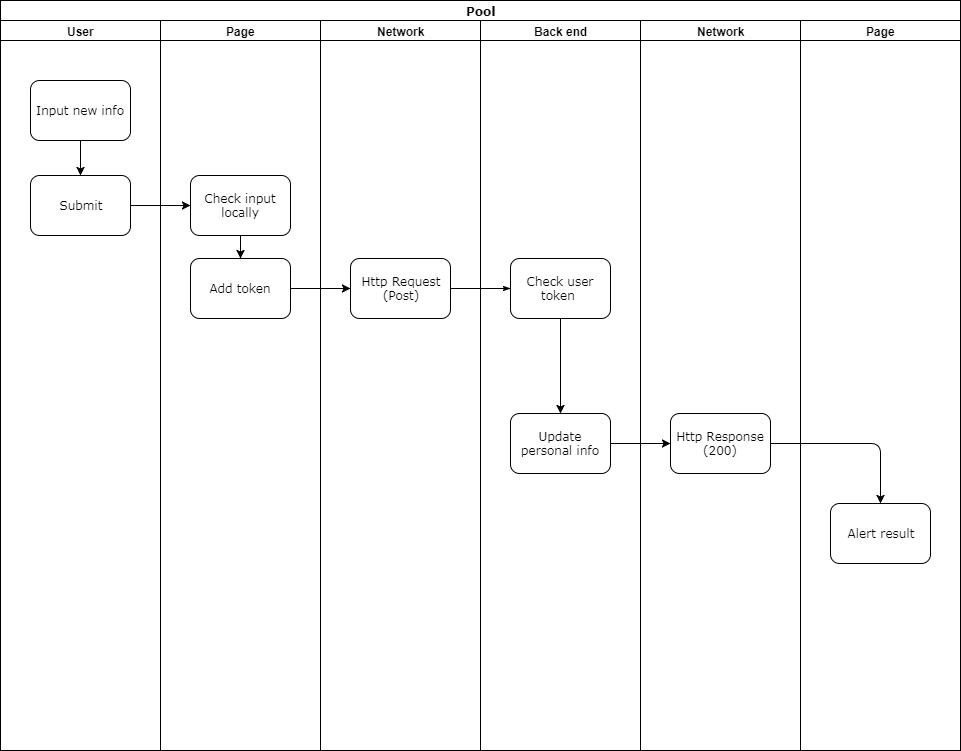
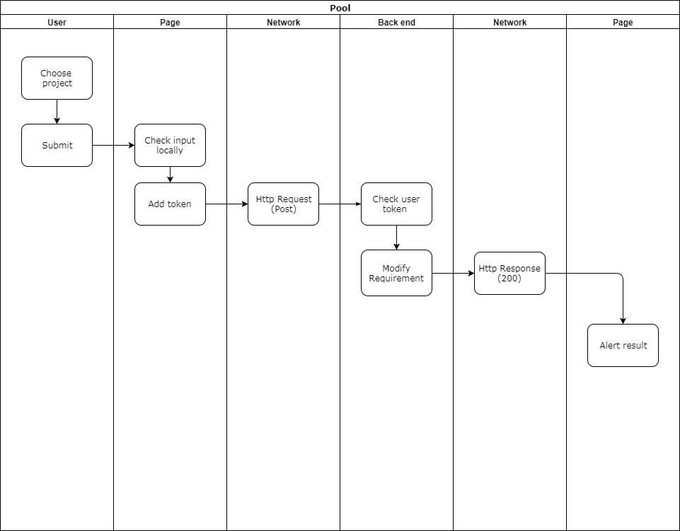
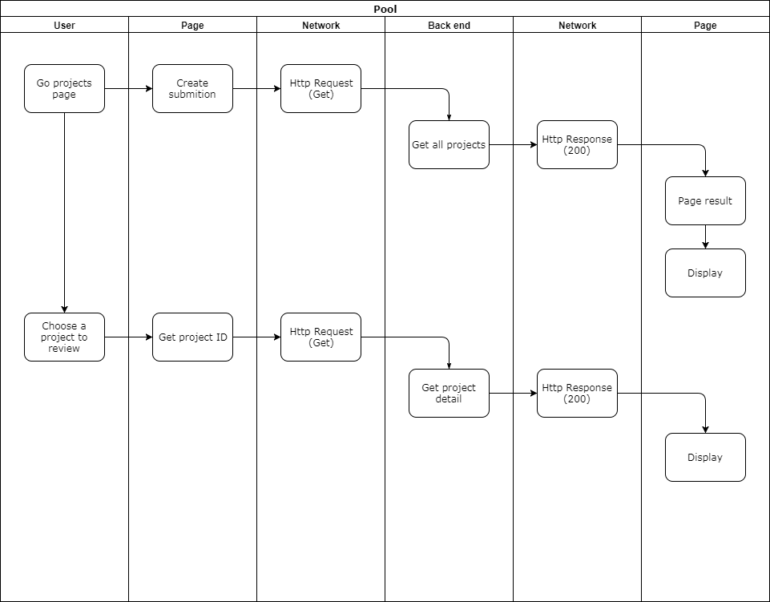

# Requirement Specification (需求规约)

## Project Introduction (项目介绍)

### Background

在软件技术和软件工程管理技术不断发展的背景下，软件开发过程不再是像以前一样复杂。其曾经由于开发难度产生的极强专业性，由于软件技术的发展带来了许多方便的开发语言和工具，已经大大降低。除了一些具有一定研发性质的软件项目，甚至是稍懂计算机的人都可以进行软件的开发工作。
而互联网的普及带动了软件的大范围推广，软件的使用方式从高性能计算逐渐转向为一般大众服务的应用工具。由于大众使用具有一定的普遍性规律，软件开发过程逐渐变得环节化，范式化。一个单一的模块组件将可以在多个不同的软件开发过程中得到使用，这使得SaaS产业日渐兴起。开发商只要开发一套软件工具，就可以一次性满足大量顾客的需求。
但是逆潮流的，定制化服务由于其在范式基础服务的基础上满足个性化的需求，开始逐渐取代一般的无差别服务。这一转变使得原本已经生产出来的模块组件不再吸引顾客，它们有些直接逐渐被淘汰，而另一些则选择了开源化。虽然它们可能商业竞争力变小了，但是对开发人员的吸引力更大了，因为只需在这些模块的基础上稍加包装，就可以完成一套定制化软件服务。
这让软件开发过程变得更加简单，最终让众包的形式成为可能。小型企业一方面不具有培养专业软件开发团队的能力，另一方面又不想要花大价钱向软件公司购买具有需求之外功能的软件服务。他们最终或选择外包公司，或选择外包团队。而众包，就是让具有开发能力的专业人士在闲暇时间有机会赚取一些外快，一方面保证了软件开发的专业性，另一方面又满足了单人开发过程的独立性，是需求方和开发方的双赢合作。

### Purpose of the project

而如今外包平台层出不穷，也有不少大学生参与其中。一方面他们的专业技术稍显稚嫩，另一方面他们的开发经验奇缺。这导致他参与的外包项目在结束前可能最终烂尾，或者在结束后没有获得应得的报酬。
本众包平台的初衷，就是在一般外包平台的形式基础上，为大学生参与外包项目提供专业支持和监督以及权益的保证，由专业人士完成项目管理的环节。

### Target users

有能力参与众包项目的大学生，和有意愿将自己项目众包化的项目组。

### Boundary of the project (what to project will do and what the project won't do)

众包交易平台是众包平台系统的组成部分，实现用户创建项目需求，招募开发者团队，以及查看项目开发进度的功能，对于开发者，提供了项目报名，项目接包功能。并在后期集成项目估价功能，可以提供专业的项目估价方案和咨询。力图将软件项目的开发流程化，便捷化，整个过程可视化，也可以让开发者在这个平台上方便的挑选项目，组队，进行开发工作。平台还提供基于机器学习的代码检测功能，对代码的质量进行评估，给用户一个直观的代码评估结果。

本项目完成众包平台中，项目市场和代码托管的部分。
项目市场：提供项目甲方发起需求的功能，提供乙方浏览、选择、参与项目的功能，提供所有本平台用户注册登录及完善个人信息的功能，提供用户添加自己项目经历的功能，提供项目甲方查看和编辑自己发起的需求详情的功能，提供乙方查看自己参与的项目详情的功能，提供其他模块的跳转功能。
代码托管：提供开发方或其他本平台用户，托管众包项目代码或个人项目代码的功能。
其他小组接入：本项目本身不提供软件过程估算业务，但完成了软件估算小组的估算模块接入。目前两个小组之间前端合并，同时估算后端与本项目后端暂时分离。

## Rquirement Analysis (项目需求分析)

### 功能性需求

#### Project market

- 登录注册————注册一个新的用户，登录系统；
- 修改个人信息————用户登录后可以修改个人信息；
- 创建任务————按照格式创建项目需求；
- 发布项目需求————发布已经创建的项目需求，在招募大厅进行招募；
- 修改项目需求————在未接包状态下更改需求或是在已接包状态下同开发者协商更改需求；
- 删除任务————在未有团队或者开发者接包的状态下删除项目需求，停止招募状态；
- 查看任务进行状态————查看已经被招募的任务开发状态；
- 个人简历————填写开发者相关的开发经验及擅长领域；
- 需求列表查看————查看发布的任务招募信息，选择适合任务进行开发，自动推送匹配合适的项目；
- 项目列表查看————查看自己所参与的项目的状态及信息；
- 项目状态转换————平台第三方审核项目组成员并进入开发状态；
- 选择估算————用户在登录情况下选择跳转至估算模块；
- 选择代码托管————用户选择跳转至代码托管平台。

### 非功能性需求

- 安全性————用户认证及页面路由锁定；
- 持久性————用户信息前端存储生命周期限制为单次浏览器使用时间；

## Use Case Analysis (用例分析)

---

### Use Case: Register （注册）

#### Description

注册用户信息。

#### Participants

未在本平台注册的访客。

#### Pre-condition (Optional)

- 进入注册页面

#### Post-condition (Optional)

- 用户注册成功并返回主页面重新登录

#### Process Flow

- 用户输入基本信息
- 系统核对格式
- 格式正常，用户点击注册按钮
- 用户邮件激活
- 用例终止

#### Exceptions (Optional)

##### User exists

- 页面获得服务端报错并提示

---

### Use Case: Login (登录)

#### Description

登录进入系统。

#### Participants

已注册用户。

#### Pre-condition (Optional)

- 进入登录页面

#### Post-condition (Optional)

- 浏览器提示登录成功并跳转至个人中心

#### Process Flow

- 用户输入用户名密码
- 点击登录按钮
- 进入主页面
- 用例终止

#### Exceptions (Optional)

##### Leak of user name or password

- 页面本地提示缺少输入

##### User not exists

- 页面获得服务端报错并提示

##### Wrong password

- 页面获得服务端报错并提示

---

### Use Case: Modify personal information （修改个人信息）

#### Description

登录成功后修改个人信息。

#### Participants

已登录用户。

#### Pre-condition (Optional)

- 登录成功
- 进入个人中心页面

#### Post-condition (Optional)

- 修改成功/修改失败

#### Process Flow

- 点击个人信息编辑
- 修改相关信息
- 点击确认按钮
- 用例终止

#### Exceptions (Optional)

##### Update Failed

- 页面获得服务端报错并提示

---

### Use Case: Check personal information （查看个人信息）

#### Description

登录成功后查看个人信息。

#### Participants

已登录用户。

#### Pre-condition (Optional)

- 登录成功

#### Post-condition (Optional)

- 查看成功/查看失败

#### Process Flow

- 进入个人中心页面
- 用例终止

#### Exceptions (Optional)

##### Request Failed

- 页面获得服务端报错并提示

---

### Use Case: Create requirement （创建需求任务）

#### Description

项目需求方创建项目需求，创建完毕后招募开发者进行开发。

#### Participants

项目需求方。

#### Pre-condition (Optional)

- 进入项目创建页面

#### Post-condition (Optional)

- 返回查看需求页面

#### Process Flow

- 点击项目创建
- 输入相关项目
- 点击确认提交按钮
- 用例终止

#### Create Failed (Optional)

- 页面获得服务端报错并提示

---

### Use Case: Update requirement （修改需求）

#### Description

在已发布需求的情况下，需求方可以对需求进行修改。

#### Participants

需求方用户。

#### Pre-condition (Optional)

- 进入项目修改页面

#### Post-condition (Optional)

- 显示项目修改成功

#### Process Flow

- 判断需求是否确定了接单人选，若无，继续进行事件流。否，则提示不能直接修改。
- 需求方输入修改的信息
- 提交修改信息
- 用例终止

#### Exceptions (Optional)

##### Wrong state of requirement

- 系统对于项目状态判断错误并返回给页面

---

### Use Case: Delete requirement （删除需求）

#### Description

在没有指定开发者的状态下，需求方可以删除已经创建的需求。

#### Participants

提出该需求的需求方。

#### Pre-condition (Optional)

- 需求方进入项目需求修改页面

#### Process Flow

- 系统判断项目是否允许被删除
- 需求方选择删除项目
- 用例终止

---

### Use Case: View projects （查看项目列表）

#### Description

开发者可以根据自己的擅长领域分类查看已经发布的项目，包含查看项目详情页面。

#### Participants

开发者。

#### Pre-condition (Optional)

- 项目列表不为空，目标需求存在

#### Post-condition (Optional)

- 系统展示具体项目详情

#### Process Flow

- 开发者发出查看项目请求
- 点击不同项目，进入不同的项目详情页面
- 用例终止

---

### Use Case: Join （报名）

#### Description

开发者可以报名感兴趣的项目。

#### Participants

开发者。

#### Pre-condition (Optional)

- 目标需求存在
- 开发者已登录

#### Post-condition (Optional)

- 系统通知报名成功

#### Process Flow

- 开发者点击报名可以进行项目的报名
- 用例终止

---

### Use Case: Create experience （新建项目经历）

#### Description

开发者可以根据自己曾经参加过的项目或者自己擅长的领域，新建个人项目经历。

#### Participants

开发者。

#### Pre-condition (Optional)

- 登录进入个人经历界面

#### Post-condition (Optional)

- 系统通知新建成功，更新页面显示

#### Process Flow

- 开发者选择新建个人经历
- 填写创建经历所必要的信息
- 点击提交
- 用例终止

---

### Use Case: Check experience （查看项目经历）

#### Description

开发者可以根据自己曾经参加过的项目或者自己擅长的领域，新建个人项目经历。

#### Participants

开发者。

#### Pre-condition (Optional)

- 登录进入个人中心界面

#### Post-condition (Optional)

- 更新页面显示。

#### Process Flow

- 开发者进入人经历页面
- 用例终止

---

### Use Case: View all projects （查看全部需求信息）

#### Description

管理员查看站点内全部需求。

#### Participants

平台管理员。

#### Pre-condition (Optional)

- 登录

#### Post-condition (Optional)

- 更新页面显示

#### Process Flow

- 管理员进入管理员界面
- 选择查看全部需求信息
- 用例结束

---

### Use Case: View all developers （查看全部用户信息）

#### Description

管理员查看站点内全部用户。

#### Participants

平台管理员。

#### Pre-condition (Optional)

- 登录

#### Post-condition (Optional)

- 更新页面显示

#### Process Flow

- 管理员进入管理员界面
- 选择查看全部用户信息
- 用例结束

---
